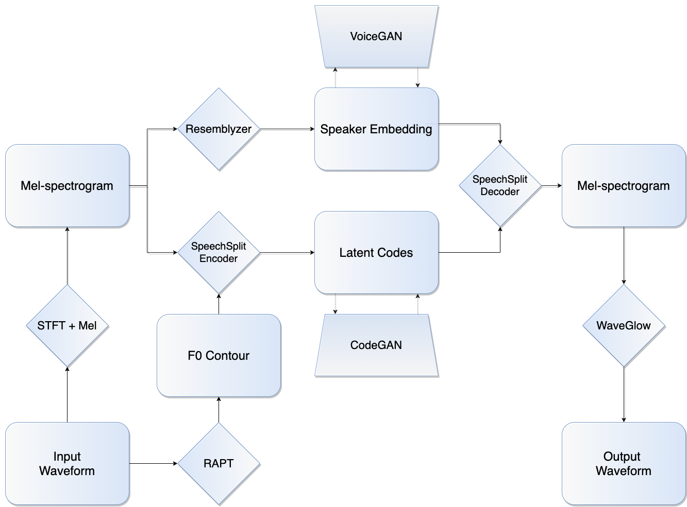

## Disentangled Representation Learning and Generative Adversarial Networks for Emotional Voice Cloning


### Motivation
* Given a recorded speech sample we would like to generate new samples havig some qualitative aspects like speaker's voice timbre, prosody, emotion etc. altered.
* Naive application of state-of-the-art GANs for image style transfer doesn't deliver good results because these in general are not well suited to handle sequential data like speech.
* The goal is to design an adversarially trained network capable of generating high quality speech samples in our setting.

### Intuition
* [SpeechSplit](https://arxiv.org/abs/2004.11284) is an autoencoder neural network whcih decomposes speech into disentangled latent representations corresponding to four main perceptual aspects of speech i.e. pitch, rhythm, lexical content and speaker's voice timbre. 
* The latents can be synthesized back into speech, hence it may be possible to perform style transfer by simply generating and substituting some of the latents to synthesize altered samples.
* Authors of SpeechSplit confirm that this method works if the latents are swapped between parallel utterances (i.e. actual recordings of people uttering the same sentence).
* We show that some latents can also be successfully generated by a relatively simple GAN, which introduces significant sample quality improvement over baseline end-to-end GANs in our voice style transfer task.
* In other words, SpeechSplit autoencoder is used in our proposed model to simplify the structure of the data so that it can be more easily captured by a GAN.

### Model Overview
1. Mel-spectrogram and pitch contour are extracted from raw waveform.
2. [Resemblyzer](https://github.com/resemble-ai/Resemblyzer) (an independent neural network trained on a speaker verification task) computes speaker embedding (a vector being a high-level representation of speaker's voice) from a mel-spectrogram.
3. Style codes for pitch, rhythm and lexical content are provided by SpeechSplit encoder.
4. New latent representations for pitch and rhythm are generated by CodeGAN, whereas new speaker embeddings are sampled from VoiceGAN.
4. SpeechSplit decoder reconstructs mel-spectrogram from speaker embedding and pitch, rhythm and content codes.
5. Mel-spectrograms are converted to output waveform by WaveGlow.



### Datasets
### Dependencies
See [requirements.txt](requirements.txt)

<!---
## Training WaveGlow
Run the script below
```bash
python waveglow/train.py -c config.json
```
## Training SpeechSplit
Run the script below
```bash
python SpeechSplit/main.py
```
## Training VoiceGAN
Run the script below
```bash
python cvoicegan/main_wgan.py
```
## Training CodeGAN
Run the script below
```bash
python codegan/main_stargan.py
```
## Generate Samples
Run the script below
```bash
python utils/fake_cvoice_samples.py
```
Code mostly or entirely written by me includes
* codegan/*
* cvoicegan/*
* utils/*
* notebooks/*

Code that was in some part rewritten by me
* waveglow/mel2samp.py
* waveglow/inference.py
* waveglow/train.py
* SpeechSplit/make_metadata.py
* SpeechSplit/make_spect_f0.py

The remaining files in waveglow/ and SpeechSplit/ were not changed.

samples.tar.gz contains sample outputs from the model


Original Repos:
https://github.com/auspicious3000/SpeechSplit
https://github.com/NVIDIA/waveglow
https://github.com/yunjey/stargan (codegan/ and cvoicegan/ follow the general structure)
--->
